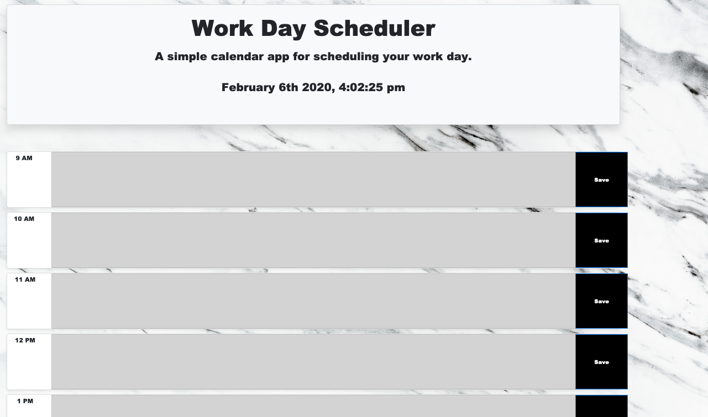

DAYPLANNER HW

Create a simple day planner for your busy WORK schedule. 

Green box color specifies current time in within hour format.
Red box color means future time slot within hour format. 
Use Moment.js for timestamp on top of website.

Application: https://skateshindler.github.io/DayPlanner/

